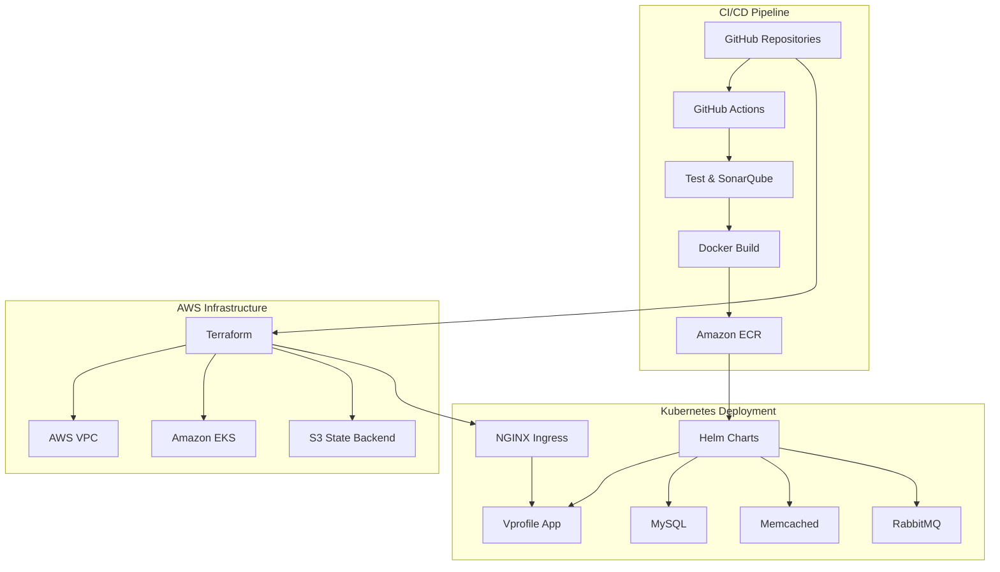
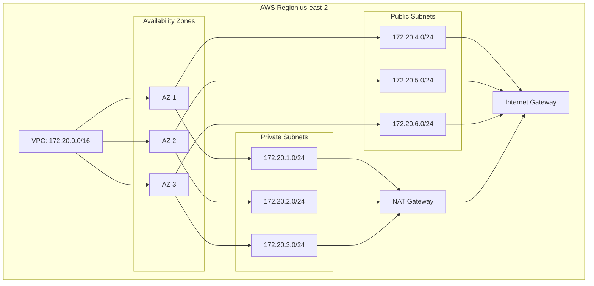
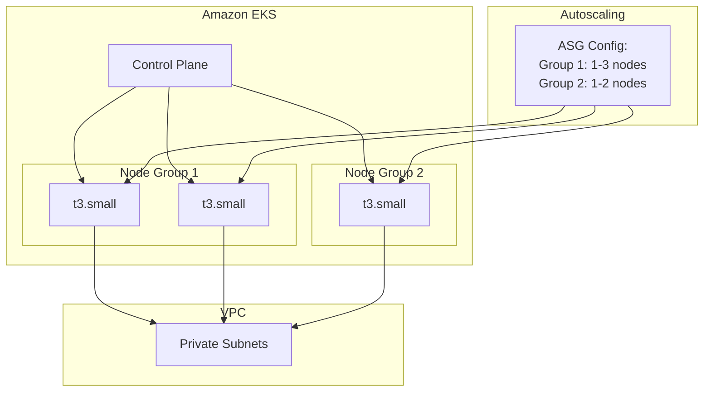
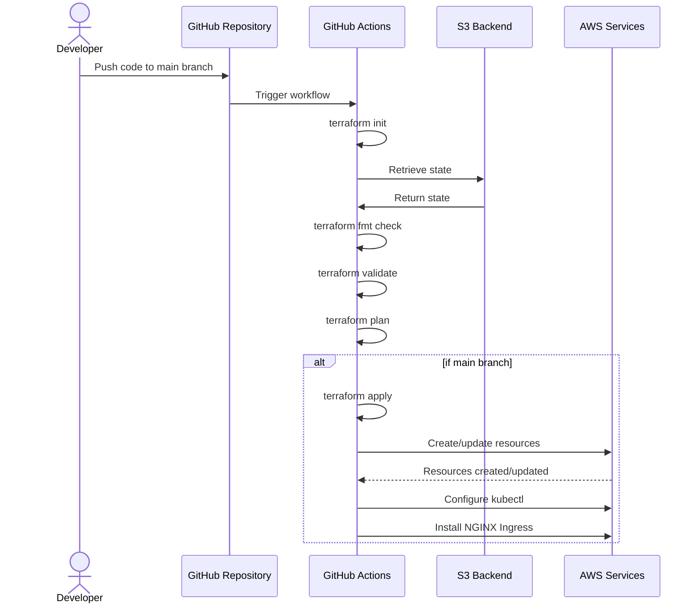
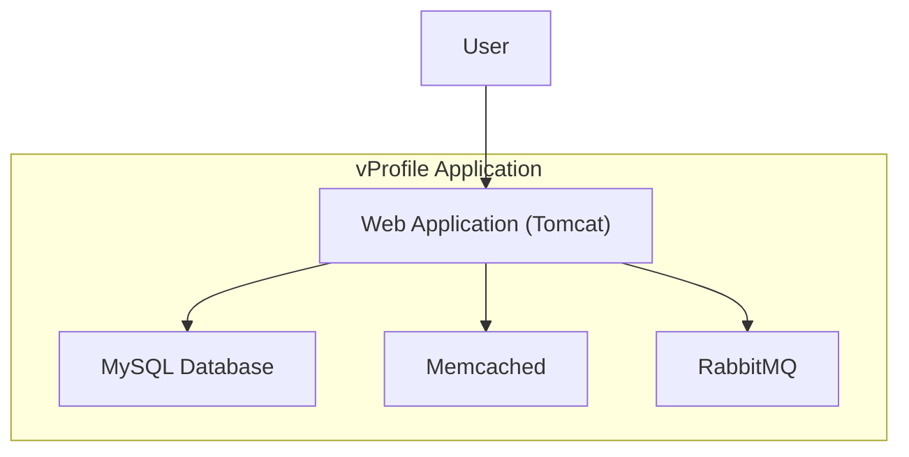
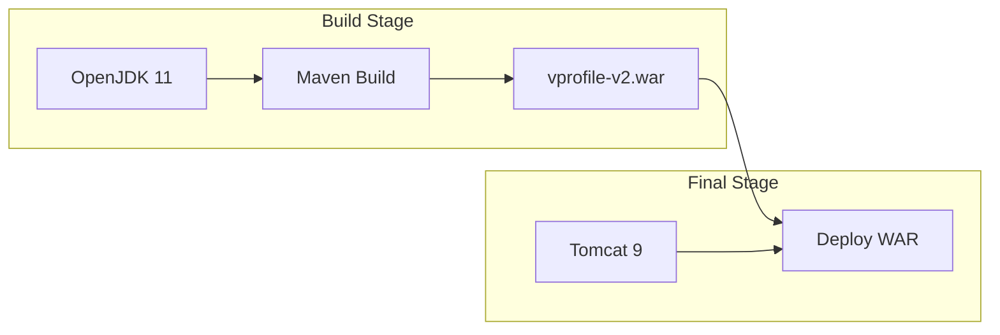
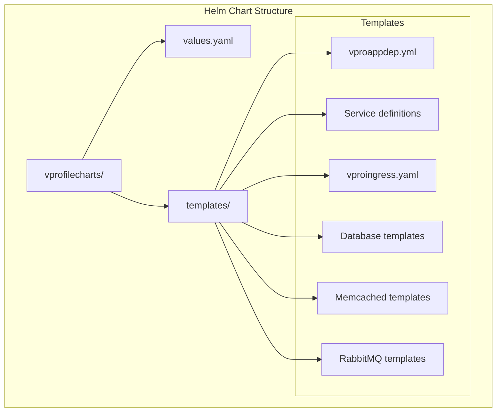
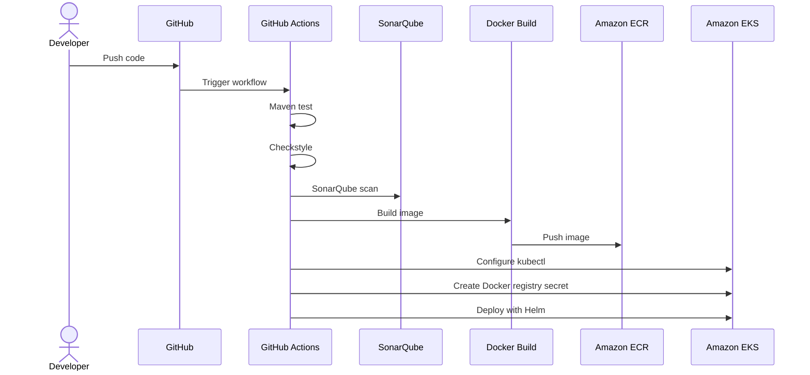
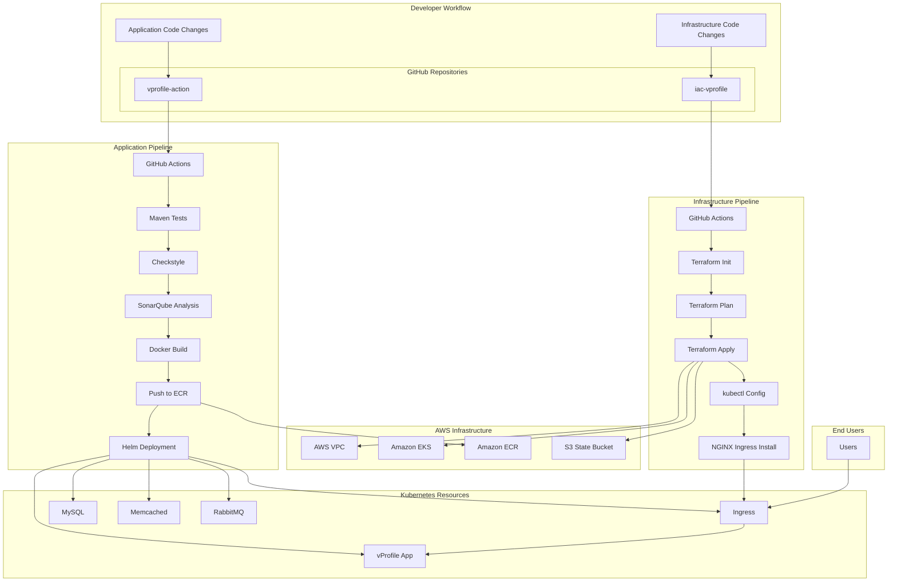

# Building a Cloud-Native DevOps Pipeline from First Principles: The vProfile Project

## Introduction

In today's rapidly evolving technological landscape, understanding how to build and deploy applications using cloud-native methodologies is essential for any software engineer. This blog post details the implementation of a complete DevOps pipeline for the vProfile application, a multi-tier Java web application, using Infrastructure as Code (IaC), containerization, Kubernetes orchestration, and CI/CD practices.

This project applies modern DevOps practices from first principles, creating a robust, scalable, and automated deployment pipeline on AWS cloud infrastructure. We'll explore each component of the system, understand the underlying principles, and see how they work together to create a seamless deployment experience.

## Project Architecture Overview

The vProfile project utilizes a microservices architecture deployed on AWS using Kubernetes. Before diving into the implementation details, let's understand the high-level architecture:



The project is divided into two main repositories:
1. **iac-vprofile**: Responsible for infrastructure provisioning using Terraform
2. **vprofile-action**: Contains the application code and deployment configurations

This separation of concerns ensures that infrastructure and application code can evolve independently while maintaining a cohesive deployment strategy.

## First Principles: Understanding the Core Concepts

### Infrastructure as Code (IaC)

At its core, Infrastructure as Code is about managing infrastructure through machine-readable definition files rather than manual processes. This approach offers several key benefits:

1. **Reproducibility**: Infrastructure can be consistently reproduced across different environments
2. **Version Control**: Infrastructure changes can be tracked, reviewed, and rolled back
3. **Automation**: Reduces manual errors and increases deployment speed
4. **Documentation**: The code itself documents the infrastructure

In our project, we use Terraform to define our AWS infrastructure, including VPC, subnets, and the EKS cluster.

### Containerization

Containers encapsulate an application and its dependencies into a self-contained unit that can run anywhere. The key principles include:

1. **Isolation**: Applications run in isolated environments
2. **Portability**: Containers run consistently across different environments
3. **Efficiency**: Lighter weight than virtual machines
4. **Scalability**: Containers can be easily scaled horizontally

We use Docker to containerize our vProfile application, creating a multi-stage build process that optimizes the final image size.

### Orchestration

Container orchestration automates the deployment, scaling, and management of containerized applications. Core principles include:

1. **Service Discovery**: Containers can find and communicate with each other
2. **Load Balancing**: Traffic is distributed across containers
3. **Self-healing**: Failed containers are automatically replaced
4. **Scaling**: Applications can scale up or down based on demand

Amazon EKS (Elastic Kubernetes Service) serves as our orchestration platform, providing a managed Kubernetes environment.

### Continuous Integration and Continuous Deployment (CI/CD)

CI/CD bridges the gap between development and operations by automating the building, testing, and deployment processes:

1. **Continuous Integration**: Code changes are regularly built and tested
2. **Continuous Delivery**: Code is always in a deployable state
3. **Continuous Deployment**: Code changes are automatically deployed to production
4. **Feedback Loops**: Developers get quick feedback on changes

GitHub Actions powers our CI/CD pipeline, automating everything from code testing to Kubernetes deployment.

## Implementing the Infrastructure with Terraform

### VPC Configuration

The foundation of our AWS infrastructure is a well-architected Virtual Private Cloud (VPC):



Our Terraform configuration creates a VPC with a CIDR block of 172.20.0.0/16, spanning three availability zones for high availability. It includes:

- Three private subnets for EKS worker nodes
- Three public subnets for the load balancer
- NAT gateway for outbound internet access from private subnets
- Appropriate tags for Kubernetes integration

Here's a key excerpt from our `vpc.tf`:

```hcl
module "vpc" {
  source  = "terraform-aws-modules/vpc/aws"
  version = "5.1.2"

  name = "vprofile-eks"
  cidr = "172.20.0.0/16"
  azs  = slice(data.aws_availability_zones.available.names, 0, 3)

  private_subnets = ["172.20.1.0/24", "172.20.2.0/24", "172.20.3.0/24"]
  public_subnets  = ["172.20.4.0/24", "172.20.5.0/24", "172.20.6.0/24"]

  enable_nat_gateway   = true
  single_nat_gateway   = true
  enable_dns_hostnames = true

  public_subnet_tags = {
    "kubernetes.io/cluster/${local.cluster_name}" = "shared"
    "kubernetes.io/role/elb"                      = 1
  }

  private_subnet_tags = {
    "kubernetes.io/cluster/${local.cluster_name}" = "shared"
    "kubernetes.io/role/internal-elb"             = 1
  }
}
```

### EKS Cluster Configuration

Amazon EKS provides a managed Kubernetes control plane, while our worker nodes run in the private subnets of our VPC:



Our EKS configuration creates a cluster with version 1.27 and two managed node groups running on t3.small instances:

```hcl
module "eks" {
  source  = "terraform-aws-modules/eks/aws"
  version = "19.19.1"

  cluster_name    = local.cluster_name
  cluster_version = "1.27"

  vpc_id                         = module.vpc.vpc_id
  subnet_ids                     = module.vpc.private_subnets
  cluster_endpoint_public_access = true

  eks_managed_node_group_defaults = {
    ami_type = "AL2_x86_64"
  }

  eks_managed_node_groups = {
    one = {
      name = "node-group-1"
      instance_types = ["t3.small"]
      min_size     = 1
      max_size     = 3
      desired_size = 2
    }

    two = {
      name = "node-group-2"
      instance_types = ["t3.small"]
      min_size     = 1
      max_size     = 2
      desired_size = 1
    }
  }
}
```

### Terraform Workflow Automation

We use GitHub Actions to automate the Terraform workflow, ensuring consistent infrastructure deployments:



The workflow includes:
1. Terraform initialization with S3 backend
2. Format checking and validation
3. Planning the infrastructure changes
4. Applying changes only on the main branch
5. Configuring kubectl and installing the NGINX ingress controller

## Application Architecture and Containerization

### vProfile Application Components

The vProfile application consists of multiple microservices:



Each component is containerized and deployed as a separate service in Kubernetes.

### Multi-stage Docker Build

We use a multi-stage Docker build to optimize our application container:



The Dockerfile efficiently builds the application and creates a lean production image:

```dockerfile
FROM openjdk:11 AS BUILD_IMAGE
RUN apt update && apt install maven -y
COPY ./ vprofile-project
RUN cd vprofile-project &&  mvn install 

FROM tomcat:9-jre11
LABEL "Project"="Vprofile"
LABEL "Author"="Imran"
RUN rm -rf /usr/local/tomcat/webapps/*
COPY --from=BUILD_IMAGE vprofile-project/target/vprofile-v2.war /usr/local/tomcat/webapps/ROOT.war

EXPOSE 8080
CMD ["catalina.sh", "run"]
```

## Kubernetes Deployment with Helm

### Helm Charts Structure

Helm is used to template and parameterize our Kubernetes manifests:



### Application Deployment

The application deployment includes initialization containers to ensure dependencies are available:

```yaml
apiVersion: apps/v1
kind: Deployment
metadata:
  name: vproapp
  labels: 
    app: vproapp
spec:
  replicas: 1
  selector:
    matchLabels:
      app: vproapp
  template:
    metadata:
      labels:
        app: vproapp
    spec:
      containers:
      - name: vproapp
        image: {{ .Values.appimage}}:{{ .Values.apptag}}
        ports:
        - name: vproapp-port
          containerPort: 8080
      initContainers:
      - name: init-mydb
        image: busybox
        command: ['sh', '-c', 'until nslookup vprodb.$(cat /var/run/secrets/kubernetes.io/serviceaccount/namespace).svc.cluster.local; do echo waiting for mydb; sleep 2; done;']
      - name: init-memcache
        image: busybox
        command: ['sh', '-c', 'until nslookup vprocache01.$(cat /var/run/secrets/kubernetes.io/serviceaccount/namespace).svc.cluster.local; do echo waiting for mydb; sleep 2; done;']
```

### Ingress Configuration

The NGINX ingress controller routes external traffic to our application:

```yaml
apiVersion: networking.k8s.io/v1
kind: Ingress
metadata:
  name: vpro-ingress
  annotations:
    nginx.ingress.kubernetes.io/use-regex: "true"
spec:
  ingressClassName: nginx
  rules:
  - host: majorproject.nikhilmishra.live
    http:
      paths:
      - path: /
        pathType: Prefix
        backend:
          service:
            name: my-app
            port:
              number: 8080
```

## CI/CD Pipeline with GitHub Actions

### Application CI/CD Workflow

Our GitHub Actions workflow for the application pipeline includes testing, building, and deploying:



The workflow includes:

1. **Testing Phase**:
   - Maven tests
   - Code style checks
   - SonarQube analysis for code quality

2. **Build and Publish Phase**:
   - Docker image building
   - Push to Amazon ECR

3. **Deployment Phase**:
   - Configure kubectl
   - Create registry credentials
   - Deploy using Helm

Here's a key excerpt from the workflow file:

```yaml
name: vprofile actions
on: workflow_dispatch
env:
  AWS_REGION: us-east-2
  ECR_REPOSITORY: vprofileapp
  EKS_CLUSTER: vprofile-eks

jobs:
  Testing:
    runs-on: ubuntu-latest
    steps:
      - name: Code checkout
        uses: actions/checkout@v4

      - name: Maven test
        run: mvn test

      - name: Checkstyle
        run: mvn checkstyle:checkstyle

      # More testing steps...
       
  BUILD_AND_PUBLISH:   
    needs: Testing
    runs-on: ubuntu-latest
    steps:
      - name: Code checkout
        uses: actions/checkout@v4

      - name: Build & Upload image to ECR
        uses: appleboy/docker-ecr-action@master
        with:
         access_key: ${{ secrets.AWS_ACCESS_KEY_ID }}
         secret_key: ${{ secrets.AWS_SECRET_ACCESS_KEY }}
         registry: ${{ secrets.REGISTRY }}
         repo: ${{ env.ECR_REPOSITORY }}
         region: ${{ env.AWS_REGION }}
         tags: latest,${{ github.run_number }}
         daemon_off: false
         dockerfile: ./Dockerfile
         context: ./

  DeployToEKS:
    needs: BUILD_AND_PUBLISH
    runs-on: ubuntu-latest
    steps:
      # Deployment steps...
      - name: Deploy Helm
        uses: bitovi/github-actions-deploy-eks-helm@v1.2.8
        with:
          aws-access-key-id: ${{ secrets.AWS_ACCESS_KEY_ID }}
          aws-secret-access-key: ${{ secrets.AWS_SECRET_ACCESS_KEY }}
          aws-region: ${{ env.AWS_REGION }}
          cluster-name: ${{ env.EKS_CLUSTER }}
          chart-path: helm/vprofilecharts
          namespace: default
          values: appimage=${{ secrets.REGISTRY }}/${{ env.ECR_REPOSITORY }},apptag=${{ github.run_number }}
          name: vprofile-stack    
```

## The Complete System: Integration and Flow

Now that we've examined each component individually, let's see how they work together in a complete CI/CD pipeline:



The workflow proceeds as follows:

1. Infrastructure changes trigger the Terraform workflow to create or update AWS resources
2. Application changes trigger the application workflow for testing, building, and deployment
3. The application is deployed to the EKS cluster created by the infrastructure pipeline
4. Users access the application through the NGINX ingress controller

## Security and Best Practices

Throughout this project, we've implemented several security best practices:

1. **Least Privilege**: Using IAM roles with minimal permissions
2. **Infrastructure Segregation**: Separating public and private subnets
3. **Secrets Management**: Storing sensitive information in GitHub Secrets
4. **Image Security**: Using multi-stage builds to minimize attack surface
5. **Code Quality**: Implementing automated testing and code analysis

## Challenges and Learning Outcomes

Building this project presented several interesting challenges:

1. **Terraform State Management**: Learning to manage state files securely using S3 backends
2. **Kubernetes Networking**: Understanding the intricacies of Kubernetes ingress and service discovery
3. **CI/CD Integration**: Connecting multiple pipelines with appropriate dependencies
4. **Container Optimization**: Creating efficient Docker images using multi-stage builds

## Conclusion

The vProfile project demonstrates a comprehensive implementation of modern DevOps principles and practices. By leveraging Infrastructure as Code, containerization, Kubernetes orchestration, and CI/CD pipelines, we've created a robust, scalable, and easily maintainable deployment pipeline.

This approach offers several key benefits:

1. **Speed**: Automated deployments reduce time-to-market
2. **Consistency**: Infrastructure and application deployments are reproducible
3. **Scalability**: Kubernetes allows for easy scaling of application components
4. **Maintainability**: Code-based infrastructure and pipelines simplify maintenance
5. **Resilience**: Multi-AZ deployment ensures high availability

The knowledge and skills gained from building this project provide a solid foundation for implementing similar architectures in other enterprise contexts. Understanding these DevOps principles from first principles enables you to adapt these patterns to various cloud platforms and application architectures.

## Future Enhancements

While the current implementation is robust, several enhancements could further improve the system:

1. **Multiple Environments**: Extend the infrastructure to support development, staging, and production
2. **Advanced Monitoring**: Implement comprehensive monitoring with Prometheus and Grafana
3. **Service Mesh**: Add Istio or Linkerd for advanced traffic management and security
4. **GitOps**: Implement ArgoCD or Flux for GitOps-based continuous deployment
5. **Automated Testing**: Add more comprehensive integration and end-to-end tests

By continuing to evolve this architecture, we can create an even more powerful and flexible DevOps platform.

---

*This project was developed as a major project for college by Nikhil Mishra. The source code is available in the [iac-vprofile](https://github.com/kaalpanikh/iac-vprofile) and [vprofile-action](https://github.com/kaalpanikh/vprofile-action) repositories.*